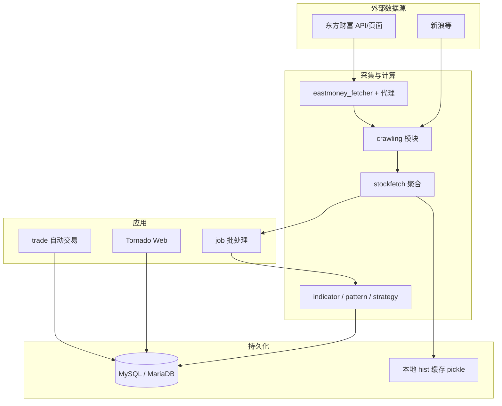

# InStock 项目架构与数据流说明

本文面向**不熟悉本仓库**的开发者与运维人员，说明整体设计、数据从哪来、如何落库、任务如何调度、历史与回测如何运作，以及如何扩展策略。细节仍以源码与 [README.md](../README.md) 为准。

**相关文档**：[快速开始](./quick-start.md) · [作业脚本说明](./jobs.md) · [部署说明](./deployment.md)

---

## 1. 文档目的与建议阅读顺序

| 顺序 | 主题 | 本文章节 |
|------|------|----------|
| 1 | 仓库分层与模块职责 | §2、§3 |
| 2 | 外部数据源与请求封装 | §4 |
| 3 | MySQL 存储与表含义 | §5 |
| 4 | 定时 / 手动作业与流水线 | §6、§7 |
| 5 | 历史补数与缓存 | §8 |
| 6 | 指标、K 线形态、选股策略 | §9 |
| 7 | 回测统计（与「交易回测框架」的区别） | §10 |
| 8 | Web 展示与扩展 | §11 |
| 9 | 自动交易与其它注意事项 | §12 |

---

## 2. 仓库目录结构（逻辑视图）

```
instock/                          # 仓库根：requirements.txt、docker、supervisor、cron
├── instock/                      # Python 包根（import 前缀 instock.*）
│   ├── job/                      # 日批/批量作业入口（与业务最相关）
│   ├── core/                     # 抓取、指标、策略判定、回测计算、表结构定义
│   │   ├── crawling/             # 各站点/API 抓取实现
│   │   ├── indicator/            # 技术指标计算
│   │   ├── pattern/              # K 线形态（Talib）
│   │   ├── strategy/             # 选股策略函数（布尔判定）
│   │   └── backtest/             # 选股结果事后收益率统计
│   ├── lib/                      # 数据库、交易日、通用运行模板
│   ├── web/                      # Tornado Web 与表格 API
│   ├── trade/                    # 自动交易（easytrader，主要面向 Windows）
│   ├── config/                   # proxy.txt、eastmoney_cookie.txt 等
│   ├── log/                      # 运行日志（作业、Web）
│   └── cache/hist/               # 日线历史 pickle 缓存（按日期分目录）
├── docker/                       # Dockerfile、compose 示例
├── supervisor/                   # supervisord：Web + 可选首次 job + cron
└── cron/                         # 被镜像安装到 /etc/cron.* 的脚本
```

运行 Python 时，**工作目录应为仓库根**（含 `requirements.txt` 的那一层），以便 `sys.path` 与脚本内路径解析一致（参见 [deployment.md](./deployment.md)）。

---

## 3. 总体架构

系统可概括为四层：



- **采集层**：`core/crawling/*` 按数据源拆分；`core/stockfetch.py` 对上提供「取某日某类数据」的函数，并做 A 股过滤、ST 过滤等。
- **配置与风控**：`core/eastmoney_fetcher.py` 统一 Session、Cookie、重试；`core/singleton_proxy.py` 读 `config/proxy.txt`。
- **元数据驱动**：`core/tablestructure.py` 定义表名、中文名、列类型及策略列表，作业与建表共用，减少硬编码。
- **持久化**：`lib/database.py` 使用 SQLAlchemy + PyMySQL，将 `DataFrame` 写入 MySQL，并处理主键。
- **展示**：`web/*` 根据「模块数据」配置生成查询页；底层走 `torndb` 读库。

---

## 4. 数据源与获取方式

### 4.1 主要来源

| 类型 | 代表模块 | 说明 |
|------|----------|------|
| 东方财富 | `crawling/stock_hist_em.py`、`stock_fund_em.py`、`stock_lhb_em.py`、`fund_etf_em.py` 等 | 行情列表、历史 K 线、资金流、龙虎榜、ETF、大宗交易等；URL 多为 `push2.eastmoney.com` 等接口。 |
| 新浪 | `crawling/trade_date_hist.py`、`crawling/stock_lhb_sina.py` 等 | 交易日历、部分龙虎榜统计。 |
| 综合选股 | `crawling/stock_selection.py` | 东方财富选股器导出类数据，映射到 `cn_stock_selection`。 |

HTTP 请求经 **`eastmoney_fetcher`**（`instock/core/eastmoney_fetcher.py`）发送：支持环境变量 `EAST_MONEY_COOKIE` 或 `config/eastmoney_cookie.txt`，并带重试与随机间隔，减轻封禁风险。

### 4.2 代理

`singleton_proxy` 读取 **`instock/config/proxy.txt`**（每行一个代理）。不使用则文件留空；修改后需重启作业进程或容器。

### 4.3 聚合入口

业务作业**不直接**调用各 crawling 文件，而是通过 **`stockfetch.py`** 中函数（如 `fetch_stocks`、`fetch_stock_hist`、`fetch_stocks_fund_flow` 等）取数，便于统一列名、过滤与异常日志。

---

## 5. 本地存储：数据库与文件

### 5.1 MySQL

- 连接配置：`instock/lib/database.py`（支持环境变量 `db_host`、`db_user` 等与 Docker 一致）。
- 默认库名：`instockdb`（`init_job.py` 可创建库与最简表）。
- 写入方式：各 job 在写入前常 **`DELETE` 当日分区** 再 `insert_db_from_df`，主键多为 `` `date`,`code` `` 类组合，保证重跑幂等。

### 5.2 表结构「单一真相」

**`instock/core/tablestructure.py`** 集中定义：

- 表英文名、`cn` 中文说明、`columns` 字段及 SQLAlchemy 类型。
- 选股策略列表 **`TABLE_CN_STOCK_STRATEGIES`**：表名、中文名、**策略函数引用**。
- K 线形态列与 Talib 函数映射、指标扩展列等。

**完整列清单（自动生成）**：见 [`database-schema.md`](./database-schema.md)；修改 `tablestructure.py` 后在 `instock` 目录执行 `PYTHONPATH=. python3 scripts/gen_database_schema_doc.py` 更新该文档。

**数据覆盖与缺失日（实施计划，仓库内维护）**：见 [`data-coverage-plan.md`](./data-coverage-plan.md)。

Web 左侧菜单与数据模块来自 **`singleton_stock_web_module_data.py`**，内部组装 `web_module_data`，指定 `table_name`、列、排序、是否「实时」模块等。

### 5.3 主要数据类别（与表对应）

下列与 `tablestructure` / `stockfetch` / Web 模块一致，便于新人建立心智模型（**非穷举所有列**，只列业务大类）：

| 业务 | 典型表名前缀 / 表 | 来源概要 |
|------|-------------------|----------|
| 综合选股 | `cn_stock_selection` | 东方财富选股器类接口 |
| 每日行情快照 | `cn_stock_spot`、`cn_etf_spot` | 当日全市场快照 |
| 资金流向 | `cn_stock_fund_flow`、行业/概念 `cn_stock_fund_flow_industry` 等 | 东财资金流排名 |
| 分红配送 | `cn_stock_bonus` | 东财财报配送 |
| 龙虎榜 | `cn_stock_lhb`（东财）、`cn_stock_top`（新浪） | 多源 |
| 大宗交易 | `cn_stock_blocktrade` | 东财；收盘后较晚才有数据 |
| 抢筹 / 涨停原因 | `cn_stock_chip_race_open/end`、`cn_stock_limitup_reason` | 东财类接口 |
| 技术指标 | `cn_stock_indicators`，买入/卖出信号表 `cn_stock_indicators_buy/sell` | 本地由历史 K 线 + Talib 计算 |
| K 线形态 | `cn_stock_pattern` | Talib CDL* 形态识别 |
| 选股策略结果 | `cn_stock_strategy_*`（如 `cn_stock_strategy_enter` 放量上涨） | 各 `strategy/*.py` 布尔判定 + 入库 |
| 回测统计 | 与指标/策略表同一套扩展列（如 N 日收益字段，见 `TABLE_CN_STOCK_BACKTEST_DATA`） | 由 `backtest/rate_stats.py` 基于历史收盘价计算 |
| 关注列表 | `cn_stock_attention` | Web 关注功能 |
| 基本面选股扩展 | `cn_stock_spot_buy` 等 | 与 spot 列结构相关 |

实际列名、中文表头均以 **`tablestructure.py`** 为准。

### 5.4 文件缓存（非数据库）

- **历史 K 线**：`instock/cache/hist/YYYYMM/YYYYMMDD/{code}*.gzip.pickle`，由 `stockfetch.stock_hist_cache` 读写，减少重复请求东财历史接口。
- **Docker 镜像**中间计划任务：`cron/cron.monthly` 会 **`rm -rf` 清空该缓存目录**（避免磁盘无限增长），路径在容器内为 `/data/InStock/instock/cache/hist/`。

---

## 6. 作业调度：自动还是手动？

### 6.1 容器内默认行为（Dockerfile + supervisor）

镜像 **`docker/Dockerfile`** 入口为 **`supervisord`**（`supervisor/supervisord.conf`），典型包含：

- **`run_web`**：持续运行 Tornado（`instock/bin/run_web.sh`）。
- **`run_cron`**：前台 **`cron -f`**（`run_cron.sh`），执行 **root 的 crontab**（镜像构建时写入）。

**Crontab 规则**（与 README「每小时 / 17:30」描述略有数值差异，**以 Dockerfile 为准**）：

```text
*/30 9,10,11,13,14,15 * * 1-5   → /etc/cron.hourly   → basic_data_daily_job.py（交易日盘中部分时段每 30 分钟）
30 17 * * 1-5                   → /etc/cron.workdayly → execute_daily_job.py（工作日 17:30）
30 10 * * 3,6                  → /etc/cron.monthly  → 清理 hist 缓存目录
```

即：**定时自动**拉取盘中基础数据 + 收盘后跑一轮「日作业」；**不是**纯实时推送行情，而是 HTTP 轮询式批量更新。

### 6.2 本机 / 开发环境

若不跑 Docker，需自行用 **cron / launchd（macOS）/ Windows 任务计划** 调用等价命令（见 [deployment.md](./deployment.md)）。

---

## 7. 日作业流水线与「当前仓库默认开启的步骤」

### 7.1 统一入口 `execute_daily_job.py`

逻辑顺序（初始化 → 基础 → 综合选股 → 并行其它 → 收盘后）见源码 **`instock/job/execute_daily_job.py`**。

**重要**：当前仓库中 **`main()` 里部分步骤被注释掉**（指标、K 线、策略、回测的并发提交与 `bdj.main()`），实际默认跑的是较轻子集 + **`basic_data_after_close_daily_job`**。若你需要完整日线指标/形态/策略/回测，需：

- 取消注释并自行验证资源与时间；或  
- **单独运行**各 `*_daily_job.py`（见下节）。

这与 README 中描述的「全量能力」可能不一致，**以你克隆版本中的 `execute_daily_job.py` 为准**。

### 7.2 单功能作业脚本（均可配合日期参数）

均通过 **`instock/lib/run_template.py` 的 `run_with_args`** 解析命令行：

| 调用形式 | 含义 |
|----------|------|
| `python3 instock/job/xxx.py` | 无参数：按 **`trade_time.get_trade_date_last()`** 推断的「最近交易日」执行（内部对 `save_nph_*` / `save_after_close` 有特殊分支） |
| `python3 instock/job/xxx.py 2024-01-02,2024-01-03` | 枚举多个交易日 |
| `python3 instock/job/xxx.py 2024-01-01 2024-01-31` | 区间内每个交易日（线程池 + 间隔） |

仅**交易日**会执行（`trade_time.is_trade_date`），依赖 **`singleton_trade_date`** 从库或接口维护的交易日集合。

常见脚本职责简述：

| 脚本 | 职责 |
|------|------|
| `init_job.py` | 建库、基础表存在性检查 |
| `basic_data_daily_job.py` | 当日股票/ETF 快照入 `cn_stock_spot` / `cn_etf_spot` |
| `selection_data_daily_job.py` | 综合选股入 `cn_stock_selection` |
| `basic_data_other_daily_job.py` | 龙虎榜、资金流、分红、抢筹、涨停原因等 |
| `basic_data_after_close_daily_job.py` | 依赖收盘或更晚披露的数据（如大宗） |
| `indicators_data_daily_job.py` | 读历史 K 线，写技术指标表 |
| `klinepattern_data_daily_job.py` | K 线形态 |
| `strategy_data_daily_job.py` | 遍历 `TABLE_CN_STOCK_STRATEGIES` 写入各策略表 |
| `backtest_data_daily_job.py` | 对已产生的买入/卖出/策略信号做 N 日收益统计并写回扩展列 |

---

## 8. 历史数据如何「同步」

本系统**没有**单独的「增量同步服务」进程；历史靠 **重复跑某日作业** 完成：

1. 确保 **`cn_stock_spot`** 等基础表在目标日期已有数据（或先跑 `basic_data_daily_job` 带日期参数）。  
2. 按依赖顺序补跑：`indicators` / `klinepattern` / `strategy` 依赖 **`stock_hist_data`**，而后者依赖当日或历史股票列表。  
3. 使用 **§7.2** 的区间或枚举参数，对每个交易日执行一遍。

**交易日过滤**：非交易日不会在 `run_with_args` 里提交执行。

**缓存注意**：历史 K 线会写本地 pickle；全量重算前可清理对应日期目录或依赖镜像的 **月 cron 清缓存**。

---

## 9. 技术指标、K 线形态与「选股策略」

### 9.1 技术指标

- 计算逻辑主要在 **`core/indicator/calculate_indicator.py`**（由 `indicators_data_daily_job` 调度）。  
- 指标列定义在 **`tablestructure.py`** 的 `STOCK_STATS_DATA` 等结构中，与 Talib 输出对齐。

### 9.2 K 线形态

- **`tablestructure.py`** 中 `STOCK_KLINE_PATTERN_DATA` 将列名映射到 **`talib.CDL*`** 函数。  
- **`klinepattern_data_daily_job.py`** 读历史数据，写入 **`cn_stock_pattern`**（逻辑名以表结构为准）。

### 9.3 内置选股策略（与交易机器人无关）

策略是 **Python 函数**：输入包含 `code/name` 与历史 K 线的 `DataFrame`，返回 **是否命中**（布尔）。注册表为 **`TABLE_CN_STOCK_STRATEGIES`**，例如：

- `enter.check_volume` → 表 `cn_stock_strategy_enter`（放量上涨）  
- `keep_increasing.check` → 均线多头  
- `parking_apron.check` → 停机坪  
- … 直至 `low_atr.check_low_increase`（低 ATR 成长）

**执行器**：`strategy_data_daily_job.py` 对每个策略调用 `run_template.run_with_args(prepare, strategy)`，在 `prepare` 内按日删旧插新。

### 9.4 如何新增一条「选股策略」

1. 在 **`instock/core/strategy/`** 下新增模块，实现 `check_*(code_name, data, date=None, **kwargs) -> bool`（可参考现有策略签名）。  
2. 在 **`tablestructure.py`** 顶部 `import` 新模块，在 **`TABLE_CN_STOCK_STRATEGIES`** 中追加一项：`name`（MySQL 表名）、`cn`、`func` 指向你的函数、`columns` 与其它策略一致（含外键列 + 回测扩展列）。  
3. 运行 **`python3 instock/job/strategy_data_daily_job.py [日期参数]`** 生成表和数据。  
4. 若要在 Web 展示，需在 **`singleton_stock_web_module_data.py`** 中注册对应 `web_module_data`（可参考已有策略表模块）。

---

## 10. 回测在本项目中的含义

### 10.1 与「量化回测框架」的区别

这里的 **`backtest_data_daily_job`** **不是** 事件驱动、撮合成交、资金曲线的完整回测引擎，而是：

- 以 **`cn_stock_indicators_buy/sell`** 与各 **`cn_stock_strategy_*`** 表中**已产生的信号日期**为起点，  
- 调用 **`core/backtest/rate_stats.py` 的 `get_rates`**，利用**历史收盘价**计算信号后若干交易日内的累计涨跌幅序列，  
- 将结果写入与表结构一致的 **回测扩展列**（`RATE_FIELDS_COUNT` 等与 N 日收益相关字段，见 `tablestructure`）。

因此更准确的叫法是 **「信号事后收益率统计」**，用于 README 所说的「验证策略成功率」类分析。

### 10.2 如何跑回测统计

在策略与买卖信号数据已存在的前提下：

```bash
python3 instock/job/backtest_data_daily_job.py
# 或带日期批量
python3 instock/job/backtest_data_daily_job.py 2024-01-02,2024-01-05
```

若 `execute_daily_job` 中未启用 `bdj.main()`，需自行运行本脚本。

### 10.3 自动交易里的「策略」

**`instock/trade/`** 下是基于 **easytrader** 的下单与定时任务（打新示例等），与 **`core/strategy` 选股** 是不同子系统；README 说明自动交易**主要面向 Windows**。新人勿混淆两套「策略」概念。

---

## 11. Web 层

- **框架**：Tornado。  
- **入口**：`instock/web/web_service.py`（默认端口 **9988**）。  
- **数据 API**：`dataTableHandler` / `dataIndicatorsHandler` 等，根据 `table_name` 查询 MySQL，与 `web_module_data` 中的列定义一致。  
- **扩展新表到界面**：在 `tablestructure` 定义表 → 数据写入 MySQL → 在 **`singleton_stock_web_module_data.py`** 增加一项 `web_module_data`（`mode`、`type`、排序、主键等）。

---

## 12. 其它新人易忽略点

| 主题 | 说明 |
|------|------|
| **单例与日期** | `singleton_stock`、`singleton_type` 等在**同一进程内**缓存股票列表与历史数据；批量跑多日时注意进程级状态是否符合预期（必要时分进程跑）。 |
| **大宗交易时间** | `stockfetch.fetch_stock_blocktrade_data` 对「当前无数据」会打日志提示晚间再取。 |
| **A 股范围** | `is_a_stock` 仅包含指定前缀主板/创业板等，北交所等规则见 `stockfetch` 注释。 |
| **日志** | 作业：`instock/log/stock_execute_job.log`；Web：`stock_web.log`。 |
| **依赖** | Python 3.11、MySQL、TA-Lib C 库；详见 README 与 [deployment.md](./deployment.md)。 |
| **合规与风险** | 数据来自公开接口与爬虫，需遵守各网站服务条款；README 声明仅供学习，不作投资建议。 |

---

## 13. 关键源码索引（便于跳转）

| 主题 | 路径 |
|------|------|
| 日作业总控 | `instock/job/execute_daily_job.py` |
| 命令行日期模板 | `instock/lib/run_template.py` |
| 交易日工具 | `instock/lib/trade_time.py`、`instock/core/singleton_trade_date.py` |
| 抓数聚合 | `instock/core/stockfetch.py` |
| 东财请求 | `instock/core/eastmoney_fetcher.py` |
| 表与策略元数据 | `instock/core/tablestructure.py` |
| 策略实现 | `instock/core/strategy/*.py` |
| 回测统计 | `instock/core/backtest/rate_stats.py`、`instock/job/backtest_data_daily_job.py` |
| 数据库封装 | `instock/lib/database.py` |
| Web 模块列表 | `instock/core/singleton_stock_web_module_data.py` |
| 容器调度 | `docker/Dockerfile`、`supervisor/supervisord.conf`、`cron/*` |

---

若你发现本文与当前分支源码不一致（例如 `execute_daily_job` 又改回「全量并行」），欢迎直接改 `docs/architecture.md` 并提交 PR。
