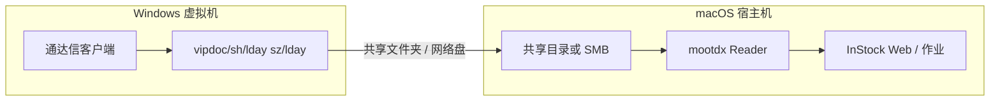

# Mac + 通达信本地数据：mootdx 读取日线方案

本文说明在 **macOS** 上运行 InStock 时，如何让 **mootdx** 以 `mootdx_local` 方式读取通达信本地的 `vipdoc` 日线（`.day` 文件），并接入 Registry / 作业流水线。

**使用 Parallels + Windows 通达信**：看 **§5 Parallels Desktop** 与 **§12 快速备忘**。

**使用 Mac 本机安装的通达信**：看 **§2.1 Mac 版通达信能否直接读本地数据**。

**文档导航**：[文档索引.md](./文档索引.md)

> InStock / mootdx 跑在 **Mac 本机或 Docker** 即可，**不需要**在通达信里再装 Python；只要磁盘上有标准 `vipdoc` 目录结构。

---

## 1. 在本项目里 mootdx 本地模式做什么

| 能力 | 实现 | 环境变量 |
|------|------|----------|
| 读单只股票日线 | `mootdx.reader.Reader` 读 `vipdoc/*/lday/*.day` | `INSTOCK_TDX_DIR` = 通达信**安装根目录** |
| 全市场代码表 | 扫描 `vipdoc/sh/lday`、`vipdoc/sz/lday` 下 `.day` 文件名 | `INSTOCK_UNIVERSE_SOURCE=local` |
| K 线拉取作业 | `mootdx_bars_sync_job` → `stock_hist_cache` → Registry 链首选 `mootdx_local` | `INSTOCK_BAR_DATA_SOURCE=mootdx` 或 `auto` |

相关代码：

- `instock/core/data/providers/mootdx_local.py` — 使用 `Reader.factory(market="std", tdxdir=INSTOCK_TDX_DIR)`
- `instock/core/mootdx_universe.py` — 本地扫描 `vipdoc`
- `scripts/verify_tdx_local.py` — 命令行自检

**数据性质**：本地 `.day` 为 **未复权 raw**，与东财前复权、Tushare 字段一致化后仍须在回测里按 `INSTOCK_BAR_MODE=raw` 使用（见 [plan/数据域.md](./plan/数据域.md)）。

---

## 2. 通达信目录长什么样（必须满足）

`INSTOCK_TDX_DIR` 指向的必须是**含 `vipdoc` 子目录**的根路径，而不是 `vipdoc` 本身。

```text
INSTOCK_TDX_DIR/          ← 环境变量指向这里（示例：/Users/you/tdx 或 /tdx）
├── vipdoc/
│   ├── sh/
│   │   └── lday/
│   │       ├── sh600000.day
│   │       └── ...
│   └── sz/
│       └── lday/
│           ├── sz000001.day
│           └── ...
├── T0002/                  ← 其它通达信目录（可有可无）
└── ...
```

InStock 健康检查会读 `600000` 的日线；证券主表本地模式会扫描 `sh/lday`、`sz/lday` 下文件名提取 6 位代码。

**前置条件**：在虚拟机里打开通达信，执行 **「系统 → 盘后数据下载」**（或等价菜单），至少下载 **沪/深 A 股日线**，否则 `lday` 为空，mootdx 会报 `FAIL empty` / `healthcheck 失败`。

Windows 上常见安装根路径（供在虚拟机内查找）：

| 常见路径 |
|----------|
| `C:\new_tdx` |
| `C:\tdxsoft\new_tdx` |
| `D:\通达信金融终端` |

在资源管理器地址栏复制该路径，确认其下存在 `vipdoc\sh\lday\*.day`。

### 2.1 Mac 版通达信能否直接读本地数据？

**可以**，但读的不是「通达信 App 正在打开的文件」，而是 **mootdx（Python）直接解析磁盘上的 `.day` 二进制文件**。与你在 Mac 还是 Windows 上安装通达信无关，关键是目录是否符合上一节的结构。

| 问题 | 说明 |
|------|------|
| Mac 版能不能被 InStock「调用」？ | **不能也不需要**。通达信只负责下载/更新数据；InStock 用 `INSTOCK_TDX_DIR` 指向安装根目录即可。 |
| Mac 版数据路径是否一样？ | 多数完整版与 Windows 相同，根目录下应有 **`vipdoc/sh/lday`、`vipdoc/sz/lday`**。具体以软件内 **系统设置 → 盘后数据下载 / 数据目录** 显示为准。 |
| 常见 Mac 路径示例 | 可能在 `~/Documents/...`、`/Applications/通达信.../` 旁的数据目录等，**以你本机设置为准**，不要照搬 Windows 的 `C:\new_tdx`。 |
| 若 Mac 版只有行情、不落盘 `.day` | 无法走 `mootdx_local`，只能用 **mootdx 在线**、**Tushare** 或 **虚拟机 Windows 通达信 + 共享目录**（§5）。 |

**自检（Mac 终端）**：

```bash
# 把 /你的/通达信根目录 换成软件设置里看到的「安装目录」或「数据目录」的上一级
export INSTOCK_TDX_DIR=/你的/通达信根目录
ls "$INSTOCK_TDX_DIR/vipdoc/sh/lday" | head
ls "$INSTOCK_TDX_DIR/vipdoc/sz/lday" | head

cd /path/to/instock   # 仓库根
python3 scripts/verify_tdx_local.py --tdx-dir "$INSTOCK_TDX_DIR" --code 600000
```

输出 `OK: provider=mootdx_local rows=...` 即表示 **Mac 本地通达信数据可被 mootdx 读取**。

**Docker InStock** 需把该目录只读挂进容器，例如：

```yaml
volumes:
  - /你的/通达信根目录:/tdx:ro
environment:
  INSTOCK_TDX_DIR: /tdx
```

---

## 3. 总体架构（Mac + 本地 vipdoc）



原则：**虚拟机只负责产生/更新 `.day` 文件**；**Mac 侧只读挂载该目录**并设置 `INSTOCK_TDX_DIR`。

---

## 4. 方案选型

| 方案 | InStock 运行方式 | TDX 数据如何到 Mac | 适合 |
|------|------------------|-------------------|------|
| **A（推荐）** | Docker | 虚拟机共享文件夹 → Mac 路径 → `docker -v` 只读挂载 | 已用 `docker-compose`、少改本机 Python |
| **B** | 本机 `python3` | 同上，直接 `export INSTOCK_TDX_DIR=...` | 开发调试、改源码 |
| **C** | Docker / 本机 | 虚拟机内开 SMB，Mac 挂载网络盘 | 共享文件夹不稳定时 |

以下步骤以 **方案 A** 为主；B/C 仅改「Mac 上的路径」与是否使用 Docker 挂载。

---

## 5. Parallels Desktop：把通达信数据弄到 Mac（推荐路径）

你使用 **Parallels** 时，最省事的做法是：**在 Mac 上建一个固定目录**，在 Windows 虚拟机里通过 **`\\Mac\Home\...`** 把通达信的 `vipdoc` 同步过去，再让 Docker / InStock 只读这个 Mac 路径。

### 5.1 打开 Parallels 共享（一次性）

1. 启动 Parallels，选中你的 **Windows 虚拟机** → **配置**（齿轮）→ **选项** → **共享**。
2. 建议勾选：
   - **与 Mac 共享 Mac 用户文件夹**（或「共享 Mac」下的 Home）
   - **允许从 Windows 访问 Mac 上的文件夹**
3. 保存后 **重启 Windows 虚拟机**（首次改共享选项时建议重启一次）。

在 Windows 资源管理器地址栏输入下面路径应能打开 Mac 用户主目录：

```text
\\Mac\Home
```

部分版本会多一个盘符（如 **`Z:`**），等价于 `\\Mac\Home`。

### 5.2 在 Mac 上准备目录

在 **Mac 终端**执行（目录名可自定，与下文环境变量一致即可）：

```bash
mkdir -p ~/tdx-local
ls -la ~/tdx-local
```

最终希望 Mac 上存在：

```text
/Users/<你的用户名>/tdx-local/vipdoc/sh/lday/*.day
/Users/<你的用户名>/tdx-local/vipdoc/sz/lday/*.day
```

### 5.3 在 Windows（通达信虚拟机）里同步数据

1. 在虚拟机里确认通达信安装根目录，例如 `C:\new_tdx`，且已有盘后数据：  
   `C:\new_tdx\vipdoc\sh\lday\sh600000.day` 等。
2. 在 Windows **以管理员打开 CMD** 或 PowerShell，执行 **首次全量复制**（把 `<Mac用户名>` 换成你 Mac 登录名，如 `fwj`）：

```bat
robocopy C:\new_tdx \\Mac\Home\tdx-local /E /XD T0002 T0001 download log /XO /R:2 /W:3
```

说明：

- `/E`：复制子目录（含 `vipdoc`）。
- `/XD`：排除通达信缓存、日志等（可按需增减；**不要排除 `vipdoc`**）。
- `/XO`：跳过 Mac 上已更新、较新的文件（日常增量时用）。
- 若通达信不在 `C:\new_tdx`，把源路径改成你的实际路径。

只想复制日线、体积更小：

```bat
robocopy C:\new_tdx\vipdoc \\Mac\Home\tdx-local\vipdoc /E /XO /R:2 /W:3
```

3. 在 Mac 终端验证：

```bash
ls ~/tdx-local/vipdoc/sh/lday | head
ls ~/tdx-local/vipdoc/sz/lday | head
```

能看到大量 `.day` 即成功。

### 5.4 日常更新（盘后下载之后）

每次在虚拟机通达信里 **「盘后数据下载」** 完成后，在 Windows 再跑一遍增量同步：

```bat
robocopy C:\new_tdx\vipdoc \\Mac\Home\tdx-local\vipdoc /E /XO /R:2 /W:3
```

可做成 Windows **任务计划程序**，工作日 17:30 执行（晚于通达信自动下载时间）。

### 5.5 Parallels + Docker InStock 挂载

Mac 路径固定为 `~/tdx-local` 时，在 `docker/docker-compose.yml` 的 `instock` 服务增加（用户名按实际替换）：

```yaml
environment:
  INSTOCK_TDX_DIR: /tdx
  INSTOCK_UNIVERSE_SOURCE: local
  INSTOCK_BAR_DATA_SOURCE: mootdx
volumes:
  - ${HOME}/tdx-local:/tdx:ro
```

若使用 **开发挂载**（`docker-compose.dev.yml`），在 `docker/` 目录：

```bash
export INSTOCK_REPO_ROOT=/Users/<你>/stock/instock
export HOME=/Users/<你>    # 确保 compose 能展开 ${HOME}
docker compose -f docker-compose.yml -f docker-compose.dev.yml up -d
```

重启后验证：

```bash
docker exec -e INSTOCK_TDX_DIR=/tdx InStock ls /tdx/vipdoc/sh/lday | head
docker exec -e INSTOCK_TDX_DIR=/tdx InStock \
  python3 /data/InStock/scripts/verify_tdx_local.py --code 600000
```

### 5.6 Parallels 常见问题

| 现象 | 处理 |
|------|------|
| Windows 里找不到 `\\Mac\Home` | 检查 Parallels **共享** 是否开启；重启 VM；在 Parallels 菜单 **设备 → 共享** 看是否勾选 Home |
| `robocopy` 报拒绝访问 | 用管理员 CMD；关闭 Mac 上对该目录的「仅读」锁定；先 `mkdir \\Mac\Home\tdx-local` |
| Mac 有文件但 Docker 看不到 | 确认 compose 里 `volumes` 写的是 Mac 上真实路径；`docker compose up -d` 重建容器 |
| 同步很慢 | 只同步 `vipdoc`，不要整盘复制 `T0002`；盘后增量用 `/XO` |
| 路径含中文 | Mac 侧建议用 `~/tdx-local` 纯英文路径 |

### 5.7 其它虚拟机（简要）

#### VMware Fusion

1. **虚拟机 → 设置 → 共享**，开启「在 Mac 与 Windows 之间共享文件夹」。
2. 添加共享点，在 Windows 资源管理器访问 `\\vmware-host\Shared Folders\...`。
3. Mac 侧路径通常在 `/Users/<你>/vmware/` 或 Fusion 设置里显示的挂载点。

### 5.3 UTM / 其它

- 优先配置 **VirtIO-FS / 目录共享**（若镜像支持）。
- 或使用 **Samba**：Windows 共享 `\\VM-IP\tdx`，Mac **访达 → 连接服务器** `smb://...` 挂载到 `/Volumes/tdx`。

### 5.4 权限与稳定性

- InStock 对 TDX 目录只需 **只读**；Docker 挂载建议加 `:ro`。
- 通达信 **正在写盘后数据时** 不要拉全市场 K 线，避免 `.day` 半写入；下载完成后再跑作业。
- Mac 路径**不要**含未转义的特殊字符；路径中有空格时用引号包裹环境变量。

---

## 6. Mac 上配置 InStock

### 6.1 确认 mootdx 已安装

仓库 `requirements.txt` 已包含 `mootdx`。Docker 镜像若较旧，需在容器内：

```bash
docker exec InStock pip install mootdx
```

本机：

```bash
cd /path/to/instock   # 仓库根
python3 -m pip install mootdx
```

### 6.2 环境变量（核心）

在 Mac 或 Docker 中设置（路径换成你实际的共享目录）：

```bash
# 通达信根目录（其下必须有 vipdoc/）
export INSTOCK_TDX_DIR=/Users/<你>/tdx-local

# 证券主表从本地 vipdoc 扫描（可选；默认 online）
export INSTOCK_UNIVERSE_SOURCE=local

# K 线作业优先 mootdx（可选：auto / mootdx / tushare / eastmoney）
export INSTOCK_BAR_DATA_SOURCE=mootdx

# 走 Registry 链（Web 手动作业「遍历拉 K 线」会自动设）
export INSTOCK_USE_DATA_REGISTRY=1
```

`.env` / `docker/.env` 示例（勿提交含隐私的路径到 Git）：

```env
INSTOCK_TDX_DIR=/Users/you/tdx-local
INSTOCK_UNIVERSE_SOURCE=local
INSTOCK_BAR_DATA_SOURCE=mootdx
```

### 6.3 Docker Compose 挂载示例

在 `docker/docker-compose.yml` 的 `instock` 服务中增加（路径按本机修改）：

```yaml
services:
  instock:
    environment:
      INSTOCK_TDX_DIR: /tdx
      INSTOCK_UNIVERSE_SOURCE: local
      INSTOCK_BAR_DATA_SOURCE: mootdx
    volumes:
      - /Users/you/tdx-local:/tdx:ro
```

使用开发挂载时（`docker-compose.dev.yml`）：

```bash
export INSTOCK_REPO_ROOT=/Users/you/stock/instock
docker compose -f docker-compose.yml -f docker-compose.dev.yml up -d
```

**注意**：容器内路径为 `/tdx`，与 `INSTOCK_TDX_DIR=/tdx` 一致；宿主机 `/Users/you/tdx-local` 下要有 `vipdoc`。

### 6.4 Web 界面

1. **任务中心 → 数据源**：查看 `mootdx_local` 的 `INSTOCK_TDX_DIR`、目录/vipdoc 是否存在，点 **验证**。
2. **数据同步 → 链路检测**：模式选 **仅本地 mootdx_local** 做探测。
3. **一键默认设置**：若要用本地 TDX 为主，可选手动作业里 **K 线日线源 = 仅 mootdx**（或自定义预设后保存）。

---

## 7. 推荐作业顺序（首次）

在 **任务中心** 或仓库根目录执行：

```bash
# 1）初始化（新库一次）
python3 instock/job/init_job.py

# 2）从本地 vipdoc 同步证券代码表（依赖 INSTOCK_TDX_DIR + INSTOCK_UNIVERSE_SOURCE=local）
INSTOCK_UNIVERSE_SOURCE=local INSTOCK_TDX_DIR=/Users/you/tdx-local \
  python3 instock/job/sync_stock_universe_job.py --source local

# 3）自检单票日线
INSTOCK_TDX_DIR=/Users/you/tdx-local \
  python3 scripts/verify_tdx_local.py --code 600000 --from-date 20240101

# 4）遍历拉 K 线（小样本试跑）
INSTOCK_TDX_DIR=/Users/you/tdx-local \
INSTOCK_BAR_DATA_SOURCE=mootdx \
INSTOCK_USE_DATA_REGISTRY=1 \
  python3 instock/job/mootdx_bars_sync_job.py --limit 20 --workers 4
```

Web 上等价操作：

1. **同步证券主表（mootdx）** — 需在子进程环境中带 `INSTOCK_UNIVERSE_SOURCE=local`（可在 `docker/.env` 写死，或扩展定时任务环境；当前手动作业默认 **online**，本地表建议用上面命令行或 `.env`）。
2. **遍历拉 K 线（日线）** — **K 线日线源** 选 **仅 mootdx**。

---

## 8. 验证清单

| 步骤 | 命令 / 操作 | 期望结果 |
|------|-------------|----------|
| 目录 | `ls "$INSTOCK_TDX_DIR/vipdoc/sh/lday" \| head` | 大量 `.day` 文件 |
| 脚本 | `python3 scripts/verify_tdx_local.py --tdx-dir ... --code 600000` | `OK: provider=mootdx_local rows=...` |
| Web | 数据源 → mootdx_local → 验证 | healthcheck 通过、样本有行数 |
| 主表 | `sync_stock_universe_job --source local` | `cn_stock_universe` 行数 > 0 |
| 拉线 | `mootdx_bars_sync_job --limit 5` | 日志为 `bars_sync[mootdx]` 且多数 `rows=` |

---

## 9. 常见问题

### 9.1 日志里写 `mootdx_bars_sync` 是不是没用 Tushare？

作业脚本历史命名如此；看 **`bars_sync[mootdx]`** 或 **`bars_sync[tushare]`** 前缀才表示当前日线源。见 [数据同步说明](./plan/数据域.md)。

### 9.2 `healthcheck 失败` / `INSTOCK_TDX_DIR 未配置`

- 环境变量未传入 **正在跑作业的那个进程**（Docker 要写在 compose / `docker exec -e`）。
- 挂载路径错：容器内 `/tdx/vipdoc` 不存在。
- `600000.day` 不存在：未下载沪市日线或未复制 `vipdoc`。

### 9.3 大量 `FAIL empty`

- 该代码在本地 `lday` 无文件（未下载、退市、仅指数）。
- 日期区间超出本地 `.day` 已有范围；先在通达信补历史数据。
- 若只想用网络源，改 **K 线日线源** 为 **仅 Tushare** 或 **自动链路**，勿设 `mootdx`。

### 9.4 本地扫描的证券表没有名称

`fetch_universe_from_tdx_dir` 只从文件名得到 `code`，`name` 为空属正常；展示名可依赖后续东财快照或其它源。

### 9.5 Mac 上能否不开虚拟机？

- **读本地 `.day`**：必须有通达信（或兼容）生成的 `vipdoc` 目录，通常仍需 Windows 虚拟机下载。
- **不读本地**：用 **mootdx 在线**（`INSTOCK_UNIVERSE_SOURCE=online`）或 **Tushare / 东财** K 线，无需 `INSTOCK_TDX_DIR`。

### 9.6 Docker 改了 `.env` 不生效

修改 `docker/.env` 或 compose 后需 **`docker compose up -d` 重建/重启** `InStock` 容器；仅改 Mac  shell 的 `export` 不会影响已在跑的容器。

---

## 10. 与 Tushare / 东财的配合建议

| 场景 | 建议 |
|------|------|
| 虚拟机通达信数据全、常更新 | `INSTOCK_BAR_DATA_SOURCE=mootdx`，主表 `local` |
| 东财网络差、已有 Tushare token | K 线用 **仅 Tushare**；快照用 **Baostock**（见 Web 一键预设） |
| 混合 | Registry **auto**：有 `INSTOCK_TDX_DIR` 时链首 `mootdx_local`，失败再 online / Tushare / 东财 |

一键配置入口：**数据同步 → 一键默认设置**（[sync_preferences](../instock/config/sync_preferences.json)）。

---

## 11. 参考

- 项目数据域说明：[plan/数据域.md](./plan/数据域.md)
- macOS / Docker 部署：[部署说明.md](./部署说明.md)
- mootdx 上游文档：<https://mootdx.readthedocs.io/>
- 本地验证脚本：`scripts/verify_tdx_local.py`

---

## 12. Parallels 快速备忘（复制后改用户名）

**Mac：**

```bash
mkdir -p ~/tdx-local
export INSTOCK_TDX_DIR=$HOME/tdx-local
export INSTOCK_UNIVERSE_SOURCE=local
export INSTOCK_BAR_DATA_SOURCE=mootdx

# 自检（仓库根目录）
python3 scripts/verify_tdx_local.py --tdx-dir "$INSTOCK_TDX_DIR" --code 600000
```

**Windows（CMD，通达信默认装在 C:\new_tdx）：**

```bat
robocopy C:\new_tdx\vipdoc \\Mac\Home\tdx-local\vipdoc /E /XO /R:2 /W:3
```

**Docker：**

```bash
docker exec -e INSTOCK_TDX_DIR=/tdx InStock ls /tdx/vipdoc/sh/lday | head
docker exec -e INSTOCK_TDX_DIR=/tdx InStock \
  python3 /data/InStock/scripts/verify_tdx_local.py --code 600000
```

（需 compose 已配置 `${HOME}/tdx-local:/tdx:ro`。）
