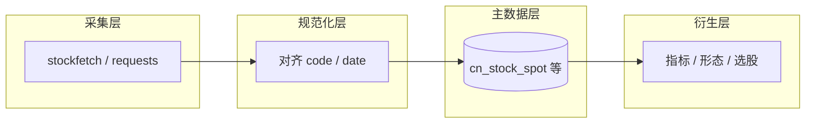

# 数据管线规划（细化版）

本文档把「长期本地维护股票数据」拆成**可验收的子能力**，并标明与当前 InStock 代码的对应关系。粒度：产品/数据工程视角 + 足够落地的验收清单；实现时可按章节拆 issue。

**范围默认**：A 股 **日线（及日频衍生表）** 为主。分钟线、tick、Level2 若引入，单独开附录论证存储与抓取成本，不混入主线验收。

**权威结构定义**：业务表字段与表名以 `instock/core/tablestructure.py` 为准；本规划不逐字段抄表，只约定**类表**的行为与治理规则。

---

## 0. 术语与数据分层

| 术语 | 含义 |
|------|------|
| **交易日历** | 上交所/深交所实际交易日序列（含临时休市规则的数据源结果），全管线对齐同一时间轴。 |
| **标的** | 股票 6 位代码、ETF 等；与库内 `code` 列一致。 |
| **自然键** | 逻辑上唯一标识一行数据的列组合，如 `(date, code)`。 |
| **幂等写入** | 同一 job 对同一自然键重复执行，结果行数与语义不变（覆盖写或 upsert）。 |
| **全量刷新** | 显式删除某区间或整表后重拉，或 `REPLACE`/truncate 后重建；必须可审计、可回滚。 |

**推荐逻辑分层**（实现可渐进，不必一次到位）：

1. **采集层**：HTTP/接口抓取、限流、重试、原始 JSON/CSV 落盘（可选）。
2. **规范化层**：字段映射、类型转换、代码表与大盘日历对齐。
3. **主数据层（Core）**：面向查询的规范化表（如 `cn_stock_spot`、`cn_etf_spot` 等），带主键/唯一索引。
4. **衍生层（Derived）**：指标、形态、选股结果、回测输入；**严格依赖**主数据层某 `batch_id` 或 `data_version` 完成后再跑。

**与现有 Job 的对应（概念）**

| 阶段 | 典型脚本 | 说明 |
|------|----------|------|
| 库与表初始化 | `instock/job/init_job.py` | 建库建表；变更需迁移策略。 |
| 基础行情与列表 | `basic_data_daily_job.py`、`basic_data_other_daily_job.py` | 主数据入口。 |
| 综合选股宽表等 | `selection_data_daily_job.py` | 依赖基础表。 |
| 收盘后数据 | `basic_data_after_close_daily_job.py` | 闭市后才完整的数据。 |
| 指标 / K 线 / 策略 | `indicators_data_daily_job.py`、`klinepattern_data_daily_job.py`、`strategy_data_daily_job.py` | 衍生层，编排上应落在主数据成功之后。 |

编排入口：`instock/job/execute_daily_job.py`（建议用配置替代「注释掉步骤」的长期做法，见 `ops-scheduling.md`）。

---

## 1. 增量更新与幂等（细化）

### 1.1 目标

- 默认 **按交易日增量**：只拉取并写入「目标交易日」相关数据，避免无意义全市场历史全表重扫。
- 任意子 job **重复执行同一日期** 不产生重复主键、不堆积重复业务行。

### 1.2 自然键约定（类表级）

实施时在 `docs` 或表注释中维护「表 → 自然键」矩阵；示例如下（具体以表结构为准，可扩展）。

| 类表 | 建议自然键 | 说明 |
|------|--------------|------|
| 日行情主表（如 `cn_stock_spot`） | `(date, code)` | 一日一股一行。 |
| 日 ETF 主表（如 `cn_etf_spot`） | `(date, code)` | 同上。 |
| 资金流等排名类日表 | `(date, code)` 或 `(date, code, rank_type)` | 若同一日多维度多行，自然键必须包含维度列。 |
| 无日期维度的「快照类」表 | 单独论证：用 `(pull_at)` 或 `(date)` | 避免与历史日线混淆。 |

### 1.3 写入策略（必选其一并文档化）

- **Upsert**：`INSERT ... ON DUPLICATE KEY UPDATE`（MySQL），更新列需明确「哪些覆盖、哪些保留首次写入」。
- **先删后插**：`DELETE FROM t WHERE date = ?` 再批量 `INSERT`；适合整日重算且无外键指向单日分片的场景。
- **版本列**：`updated_at` / `ingest_batch_id`；便于审计与下游判断「本日是否已跑完」。

### 1.4 CLI 与行为

- 统一支持：`--date YYYY-MM-DD`、`--from` / `--to`、`--dry-run`（只拉不落或只校验）、`--force`（显式全量或覆盖）。
- `--force` 必须打日志并可在元数据表中记一条审计记录。

### 1.5 验收清单（增量与幂等）

- [ ] 每张主数据表在库内有 **PRIMARY KEY 或 UNIQUE**，且与自然键一致。
- [ ] 对同一 `date` 连续执行两次基础 job，行数不变、关键数值列不变（或在允许的浮点误差内）。
- [ ] 文档中列出「全量刷新」适用表与命令，避免误操作生产库。

### 1.6 InStock 映射

- 实现入口：`instock/job/*.py`、数据写入逻辑多在 `instock/core/stockfetch.py` 及与 `tablestructure` 绑定的插入代码。
- 风险：部分表若当前为「纯追加 INSERT」，需改为 upsert 或 先删后插。

---

## 2. 数据质量校验（细化）

### 2.1 校验时机

- **每日主数据写入后** 必跑一批「硬规则」校验（可独立脚本 `scripts/validate_daily.py` 或挂在 job 末尾）。
- **衍生层开始前** 可选跑「软规则」（警告不阻断），避免垃圾进垃圾出。

### 2.2 硬规则（建议默认启用）

| 编号 | 规则 | 失败处理 |
|------|------|----------|
| H1 | 对目标交易日，主表行数 ≥ 最小阈值（如 ≥ 当日预期上市股票数 × 配置比例） | 失败：告警 + 可选阻断下游 |
| H2 | `open_price`、`high_price`、`low_price`、`new_price`（或等价收盘价字段）非空且 `high >= low` | 失败：记录股票列表 |
| H3 | `high >= max(open, close)`，`low <= min(open, close)`（按你库字段名调整） | 失败 |
| H4 | `volume`、`deal_amount` ≥ 0（允许 NULL 的字段单独白名单） | 失败或警告按表约定 |
| H5 | `code` 长度与字符集符合规范（如 6 位数字主表） | 失败 |
| H6 | `date` 必须为交易日且与 job 参数一致 | 失败 |

### 2.3 软规则（默认警告）

- 涨跌幅绝对值超过例如 25%（科创板等例外用规则表或配置豁免）。
- 换手率、量比极端离群（仅标记，供人工抽查）。
- 与前一交易日相比成交量为 0 但非停牌（需停牌数据源或第三方对照，可分阶段做）。

### 2.4 输出形态

- **机器可读**：JSON 或写入表 `data_quality_run`（`run_id, trade_date, rule_id, severity, detail_json`）。
- **人类可读**：简短摘要日志一行 + 附件路径。

### 2.5 与下游联动

- 环境变量或配置：`QUALITY_FAIL_BLOCK_DERIVED=true|false`。
- 为 `true` 时：`indicators_*` / `selection_*` 等不得开始执行。

### 2.6 验收清单

- [ ] 注入故意错误 OHLC 的测试数据，硬规则必失败且报告含 `code` 列表。
- [ ] 配置阻断时，衍生 job 未启动并有明确日志。

---

## 3. 断档检测与补数（细化）

### 3.1 交易日历来源

- **优先**：交易所官方日历或可信第三方日历表本地化一张 `trade_calendar`（`date`, `is_open`）。
- **兜底**：用主表 `cn_stock_spot` 出现过的 `date` 并集近似（弱于官方，仅作辅助）。

### 3.2 断档类型

| 类型 | 描述 | 处理 |
|------|------|------|
| T1 全局缺日 | 日历日为交易日但库中整日无数据 | 高优先级补拉 |
| T2 单股缺日 | 当日有大盘数据但该 `code` 无行 | 补拉或标记退市/停牌 |
| T3 字段缺块 | 行存在但关键列为 NULL | 走质量报告，必要时补拉 |

### 3.3 补数流程（建议步骤）

1. `detect_gaps --from A --to B` → 输出缺口列表（日期、可选 code）。
2. `repair_gaps --dates ...` 或 `--from/--to` → 调用与日常相同的 fetch，仅针对缺口。
3. 再跑 `validate_daily` → 缺口清零或剩余项在「白名单」（退市等）中可解释。

### 3.4 验收清单

- [ ] 删除某日若干行后，检测能列出缺口，补数后校验通过。
- [ ] 对已知退市代码，文档说明「允许永久缺数」的判定条件。

---

## 4. 数据源抽象（细化）

### 4.1 接口形态（建议）

定义薄接口（模块名示例，实现时可调整）：

- `fetch_calendar() -> DataFrame`
- `fetch_stock_list(as_of: date) -> DataFrame`
- `fetch_daily_bars(trade_date: date, codes: Optional[Iterable]) -> DataFrame`

**原则**：Job 只依赖接口返回的 **标准列名**；具体 URL、解析、反爬在 `adapter_eastmoney` 等实现类中。

### 4.2 熔断与主备

- 连续失败 `N` 次或 HTTP 429 → 暂停 `T` 秒；超过阈值则 **失败退出**（避免半套数据）。
- 可选第二数据源：同一接口两种实现，由配置 `DATA_SOURCE=primary|secondary` 切换。

### 4.3 测试

- `MockDataSource` 返回固定 Parquet/CSV，CI 中跑「写入 + 校验」集成测试，不访问外网。

### 4.4 验收清单

- [ ] 至少一条 job 路径可通过 mock 源跑通（不要求真实 key）。
- [ ] 抓取层无直接 SQL；SQL 仅在写入适配层或 repository。

### 4.5 InStock 映射

- 当前集中：`instock/core/stockfetch.py`；重构宜「由外向内」：先抽接口再迁实现。

---

## 5. 证券元数据与历史一致（细化）

### 5.1 问题陈述

用「今天的全市场股票列表」去清洗或回算历史，会导致 **幸存者偏差**（退市股消失、ST 状态错位）。

### 5.2 建议表（概念）

| 表 / 概念 | 用途 |
|-----------|------|
| `security_master` | `code`, `name`, `list_date`, `delist_date`, `asset_type` |
| `security_status_history` | ST、*ST、暂停上市等：`code`, `effective_date`, `status` |
| `industry_membership` | 行业归属：`code`, `industry`, `from_date`, `to_date`（或缓慢变化维） |

不要求一次建全表；可分阶段：**先 list_date / delist_date**，再行业历史。

### 5.3 复权与价格体系

- 明确库内价格：**不复权 / 前复权 / 后复权** 哪一种；混用必须字段后缀区分（如 `_qfq`）。
- 复权因子变更：记录 `adj_factor` 表 + `as_of_pull_time`，便于回测绑定数据版本（与 `backtest.md` 联动）。

### 5.4 验收清单

- [ ] 文档写明「历史回测可用股票池」的判定规则（上市 ≤ 当日 ≤ 退市）。
- [ ] 随机抽 3 只退市股，历史区间内在主数据中可查到或按规则解释缺失。

---

## 6. 存储与性能（细化）

### 6.1 索引规范（原则）

- 主数据按查询模式：必建 `(date)`、`(code)`、`(date, code)` 中至少满足 Web 与 job 最频繁组合。
- 避免过多低选择性索引；大表变更索引走在线 DDL 策略（运维文档）。

### 6.2 分区（可选，数据量达阈值后做）

- 按 `RANGE (YEAR(date))` 或按月分区大表；保留「未分区备份策略」以防回滚。

### 6.3 维护窗口

- 定期 `ANALYZE TABLE` / 统计信息更新（写入 ops 文档）。
- 大删除/归档后 `OPTIMIZE` 是否执行由空间与锁表容忍度决定，不强制。

### 6.4 验收清单

- [ ] 对 `SELECT ... WHERE date = ? AND code = ?` 类查询有 `EXPLAIN` 基线（截图或文本存 `docs/` 可选）。
- [ ] 单表行数超过约定阈值（如 5000 万）时触发分区评审（记录在 `roadmap` 或运维 wiki）。

---

## 7. 备份与恢复（细化）

### 7.1 备份类型

| 类型 | 频率 | 用途 |
|------|------|------|
| 逻辑全量 | 每周（示例） | 灾难恢复、迁移 |
| 逻辑增量 / binlog | 每日（示例） | 点到时间点恢复 |
| 单表导出 | 发版前 / 大迁移前 | 回滚单表 |

具体命令与路径不写死在本规划；在 `docs/ops/backup.md`（若创建）给可复制命令。

### 7.2 恢复演练

- 每季度至少一次：新空实例 → 还原 → 跑 `validate_daily` + 最小 Web 查询。

### 7.3 验收清单

- [ ] 存在书面恢复步骤，且最近一次演练有日期记录。
- [ ] 备份文件权限与磁盘监控（避免备份占满盘）。

---

## 8. 配置与安全（细化）

### 8.1 敏感配置清单（须环境变量或 gitignore 文件）

- DB：`db_host`、`db_user`、`db_password`、`db_database`、`db_port`（已与 `instock/lib/database.py` 对齐）。
- 网络：`proxy.txt`、`eastmoney_cookie.txt` 等路径不提交真实内容。
- 可选：`HTTP_PROXY`、`DATA_SOURCE`。

### 8.2 仓库卫生

- [ ] 提供 `.env.example` 列出键名与示例占位符。
- [ ] `git grep -i password` 预提交或 CI 检查（可选）。

---

## 9. Schema 演进与迁移（补充章节）

长期维护必有「改表」；不设流程会导致各环境 schema 漂移。

### 9.1 需求

- 每次 `tablestructure.py` 或建表逻辑变更，对应一条 **迁移说明**：向上/向下步骤、是否锁表、是否需重算衍生表。
- 可选引入工具：Alembic / 自增 SQL 版本号文件夹 `migrations/001_xxx.sql`。

### 9.2 验收清单

- [ ] 从空库到最新 schema 有一条唯一权威路径（`init_job` + migrations 或等价）。
- [ ] 生产升级 checklist：备份 → 迁移 → 校验 → 开 job。

---

## 10. 实施优先级建议（数据管线单线）

1. **P0**：主数据表自然键 + 幂等写入 + 硬规则校验 + 备份文档。  
2. **P1**：交易日历表 + 断档检测/补数 CLI。  
3. **P2**：数据源接口抽象 + mock 集成测试。  
4. **P3**：证券主数据历史一致 + 复权版本记录。  
5. **P4**：分区与性能基线、schema 迁移工具化。

---

## 11. 已实现代码映射（2026-05-14）

| 规划章节 | 实现位置 |
|----------|----------|
| §1 幂等 / CLI | 既有「先删后插」保留；`instock/lib/job_argparse.py`；`basic_data_daily_job.py` 支持 `--date` / `--from-date`/`--to-date` / `--dry-run` / `--force` |
| §2 质量校验 | `instock/core/pipeline/data_quality.py`；`scripts/validate_daily.py`；默认跑批 `len(sys.argv)==1` 时在 ETF 写入后校验；`INSTOCK_QUALITY_STRICT` 失败抛错 |
| §3 断档 | `instock/core/pipeline/gaps.py`；`scripts/detect_gaps.py`；补数仍通过重跑 `basic_data_daily_job` 指定日期 |
| §4 数据源抽象 | `instock/core/pipeline/data_source.py`；ETF 经 `get_default_market_data_source()` 拉取 |
| 交易日历落库 | `instock/core/pipeline/trade_calendar.py`；`init_job` 建表；`execute_daily_job` 默认同步（`INSTOCK_SYNC_TRADE_CALENDAR=0` 可关）；独立 `job/sync_trade_calendar_job.py` |
| §7 备份 | 未实现（按需求保持低优先级） |
| §8 配置 | 根目录 `.env.example` 注释说明 |

---

## 12. 修订记录

| 日期 | 摘要 |
|------|------|
| 2026-05-14 | 初版细化：分层、校验规则、断档类型、元数据表、迁移、优先级 |
| 2026-05-14 | 补充 §12：与已落地代码路径对照 |
