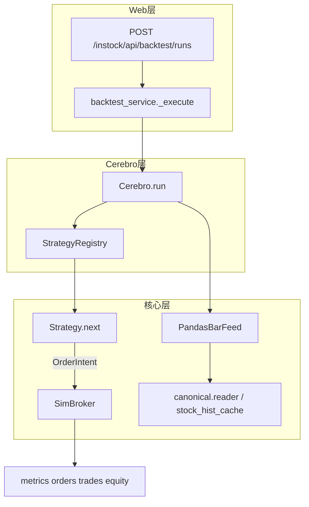

# Backtrader 式回测架构规划

> **状态**：已实施（阶段 A–E 代码落地，可按验收清单持续补强）  
> **关联需求**：[回测.md](./回测.md)、[策略.md](./策略.md)、[路线图.md](./路线图.md)  
> **API 契约**：[../回测-api契约.md](../回测-api契约.md)

将 InStock 撮合回测从单函数双均线演进为 **Cerebro + Strategy + DataFeed + Broker** 的可插拔事件驱动框架，风格对齐 Backtrader（**不引入** `backtrader` 第三方库）。

---

## 0. 边界

| 类型 | 位置 | 说明 |
|------|------|------|
| **撮合回测**（本方案） | `instock/core/backtest/` | 资金曲线、订单、成交、绩效 |
| **选股筛选**（已有） | `instock/core/strategy/` + `strategy_data_daily_job.py` | `check_*` → `cn_stock_strategy_*`；可通过适配器策略桥接，不合并 API |
| **事后收益统计**（已有） | `backtest_data_daily_job.py` | 信号后 N 日涨跌，非撮合回测 |

默认撮合口径（与 [回测.md](./回测.md) 一致）：**T 日收盘后 `next()` 产生信号，T+1 日按开盘价成交**。

---

## 1. 目标与 Backtrader 概念映射

| Backtrader | InStock 组件 | 职责 |
|------------|--------------|------|
| `Cerebro` | `Cerebro` | 组装数据、策略、经纪商；按交易日推进主循环 |
| `Strategy` | `Strategy` 基类 + 用户子类 | `start()` / `next()` / `stop()`；只发单意图 |
| `Data` / `DataFeed` | `feeds.prepare_bars` | 从 `bars_by_code` 或 DB reader 按 symbol 迭代 bar |
| `Broker` | `SimBroker` | T+1、费用、100 股整数、次日 open 撮合 |
| `addstrategy` | `StrategyRegistry` | `strategy_id` → 策略类；Web/API 传 id + params |
| `run()` | `registry.run_backtest()` | 返回与 [../回测-api契约.md](../回测-api契约.md) 一致的 JSON |



---

## 2. 现状（实施后）

| 能力 | 代码位置 |
|------|----------|
| 双均线 / 买入持有 / 选股桥接 | `instock/core/backtest/strategies/` |
| 策略注册与分发 | `registry.py`；`backtest_service` 按 `strategy.id` |
| 策略列表 API | `GET /instock/api/backtest/strategies` |
| 用户插件 | `strategies/plugins/` + [自定义回测策略.md](./自定义回测策略.md) |
| 兼容旧入口 | `engine.run_moving_average_backtest` → `run_backtest` |

---

## 3. 目录与模块设计

```
instock/core/backtest/
  cerebro.py
  strategy.py
  broker.py
  feeds.py
  registry.py
  result.py
  engine.py               # 兼容层
  strategies/
    moving_average.py
    buy_and_hold.py
    screening_bridge.py
    plugins/              # 用户自定义
```

---

## 4. 分阶段实施

对应 [路线图.md](./路线图.md) 阶段 2→3。

| 阶段 | 内容 | 状态 |
|------|------|------|
| **A** | `SimBroker` + `Cerebro` | 已完成 |
| **B** | `Strategy` + 双均线 + API 分发 | 已完成 |
| **C** | `StrategyRegistry` + `GET /strategies` | 已完成 |
| **D** | `plugins/` + 文档 | 已完成 |
| **E** | `ScreeningBridgeStrategy` | 已完成 |

**一期不做**：分钟/tick、多周期 resample、vn.py 式实盘网关、向量化主引擎。

---

## 5. Web / 数据 / 复现

- **数据**：`_load_bars` → canonical → `stock_hist_cache`；`requirePrerequisites` 不变
- **复现**：`params_hash`（strategy id + params）写入结果 `params`
- **前端**：`BacktestPlaceholderView.vue`；`listBacktestStrategies()` 已接 API（策略下拉可继续增强）

---

## 6. 验收标准

| 编号 | 验收项 |
|------|--------|
| BT-BT-1 | 新策略仅新增 `strategies/plugins/xxx.py` + 注册 |
| BT-BT-2 | `moving_average_cross` fixture 与迁移前一致 |
| BT-BT-3 | API `strategy.id` 执行对应策略类 |
| BT-BT-4 | T+1：当日买不可当日卖 |
| BT-BT-5 | 结果 JSON 满足 API 契约 |

详见 [回测验收清单.md](./回测验收清单.md)。

---

## 7. 实施任务勾选

- [x] 阶段 A–E
- [x] [仓库对齐.md](./仓库对齐.md) 目录映射

---

## 8. 实施注意

- 保持 `backtest_service` 线程模型与 `instock/log/backtest_runs/*.json` 不变
- 不修改 `backtest_data_daily_job.py`（事后收益与撮合分离）

---

## 修订记录

| 日期 | 摘要 |
|------|------|
| 2026-05-25 | 初版实施方案 |
| 2026-05-25 | 并入 `docs/plan/`，与 `plans/` 统一 |
