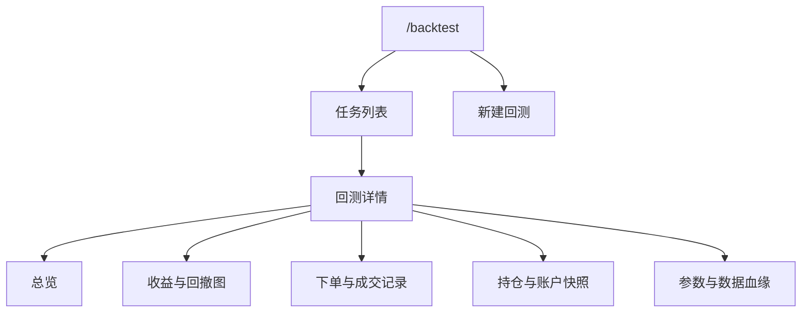

# 回测前端设计

本文档定义 `/backtest` 模块第一期前端设计，覆盖页面结构、图表、表格、交互状态和 API 数据需求。后端契约见 [`../回测-api契约.md`](../回测-api契约.md)，回测业务需求见 [`回测需求.md`](回测需求.md)。

## 1. 设计目标

回测前端要让用户完成三件事：

1. 配置并启动一次回测。
2. 观察回测任务状态和失败原因。
3. 分析回测结果，包括收益曲线、回撤、下单/成交记录、持仓、账户快照和数据血缘。

第一期页面不追求复杂投研工作台，重点是把回测结果讲清楚，并让用户能定位“为什么赚/亏、在哪些交易上赚/亏、数据是否可信”。

## 2. 页面信息架构

第一期建议采用左右结构：

- 左侧：任务列表和新建按钮。
- 右侧：当前任务详情。
- 小屏幕：任务列表置顶，详情在下方。

## 3. 新建回测面板

新建回测采用抽屉或页面内表单。字段分组如下：

### 3.1 基础信息

- 回测名称。
- 起始日期、结束日期。
- 初始资金。
- 基准指数，可选。

### 3.2 股票池

支持三种输入：

- 手工代码列表，例如 `600000,000001`。
- 从已有策略信号表选择。
- 全市场过滤，第一期可只保留入口和禁用态。

必须展示股票池规模预估。如果无法预估，应提示“运行时校验”。

### 3.3 策略

- 策略选择：双均线、指标买卖信号、策略信号适配器。
- 策略参数动态表单。例如双均线包含 `fast`、`slow`。
- 参数校验：短周期必须小于长周期，数值必须为正整数。

### 3.4 撮合与成本

- 撮合价格：下一交易日开盘价、下一交易日收盘价。
- 佣金率。
- 最低佣金。
- 印花税率。
- 过户费率。
- 滑点，单位 bps。

### 3.5 风控约束

- 最大持仓数。
- 单票仓位上限。
- 总仓位上限。
- 是否允许空仓。

### 3.6 数据设置

- 数据 profile：默认 `backtest`。
- 价格口径：默认 `raw`。
- 启动前置检查：默认开启，不建议关闭。

提交前，前端应先调用创建任务接口。若后端返回数据缺口错误，表单不关闭，并展示缺失数据详情和建议补跑 job。

## 4. 任务列表

任务列表用于快速切换历史回测。建议列展示：

- 状态：排队、运行中、成功、失败、已取消。
- 回测名称。
- 策略名称。
- 区间。
- 股票池摘要。
- 累计收益。
- 最大回撤。
- 创建时间。

交互要求：

- 运行中任务每 2 秒轮询。
- 成功任务点击后进入详情。
- 失败任务点击后展示错误摘要。
- 支持删除历史任务。
- 支持取消运行中任务。

状态颜色只用于状态本身，不要在收益指标上使用过多颜色。收益为正可轻量标红或绿色，但要和项目现有颜色习惯保持一致。

## 5. 回测详情总览

详情页顶部为摘要区，展示最重要的结果：

- 累计收益。
- 年化收益。
- 最大回撤。
- 夏普比率。
- 胜率。
- 交易次数。
- 当前总资产。
- 回测区间。

摘要区下方展示参数摘要：

- 策略与参数。
- 股票池。
- 撮合口径。
- 成本参数。
- 数据 profile 和价格口径。

如果回测失败，详情页不展示空图表，只展示失败原因、错误码、数据缺口和建议操作。

## 6. 收益曲线与回撤图

收益分析是详情页核心区域。至少包含两张图：

### 6.1 权益曲线

图表数据：

- X 轴：交易日期。
- Y 轴：标准化权益或总资产。
- 系列：策略权益、基准权益。

交互：

- 鼠标悬浮展示日期、策略权益、基准权益、当日收益。
- 支持显示/隐藏基准。
- 图例展示策略和基准名称。

### 6.2 回撤曲线

图表数据：

- X 轴：交易日期。
- Y 轴：回撤百分比。
- 系列：策略回撤。

交互：

- 鼠标悬浮展示日期、回撤、当日总资产。
- 最大回撤区间应在指标卡中展示，图上可后续增强标注。

图表空态：

- 运行中：展示加载态。
- 失败：展示错误态，不渲染空图。
- 数据不足：展示“权益数据不足，无法绘图”。

## 7. 下单与成交记录

用户明确需要看到回测时的下单记录。第一期应区分“策略生成的订单”和“实际成交”。

### 7.1 订单记录表

订单记录表示策略意图，包含：

- 订单 ID。
- 生成日期。
- 目标成交日期。
- 股票代码。
- 股票名称。
- 买卖方向。
- 订单类型：目标权重、目标数量、市价。
- 请求数量。
- 请求目标权重。
- 策略原因。
- 订单状态：待撮合、已成交、部分成交、拒单、取消。
- 拒单原因：停牌、涨停、跌停、现金不足、持仓不足、非交易日等。

### 7.2 成交记录表

成交记录表示真实撮合结果，包含：

- 成交 ID。
- 订单 ID。
- 成交日期。
- 股票代码。
- 股票名称。
- 买卖方向。
- 成交数量。
- 成交价格。
- 成交金额。
- 佣金。
- 印花税。
- 过户费。
- 滑点成本。
- 总费用。
- 成交后现金。
- 成交后持仓。
- 策略原因。

表格交互：

- 按日期、代码、方向、状态筛选。
- 支持只看拒单。
- 支持导出 CSV，后续实现。
- 点击成交行时，可在收益曲线上定位对应日期，后续实现。

## 8. 持仓与账户快照

### 8.1 每日持仓表

展示每个交易日的持仓明细：

- 日期。
- 股票代码。
- 股票名称。
- 持仓数量。
- 可卖数量。
- 成本价。
- 收盘价。
- 市值。
- 浮动盈亏。
- 权重。
- 持仓天数。

### 8.2 每日账户快照表

展示账户维度时间序列：

- 日期。
- 现金。
- 持仓市值。
- 总资产。
- 当日收益率。
- 累计收益率。
- 回撤。
- 当日成交次数。
- 当日换手率。

账户快照表和权益曲线必须能对齐：某日 `totalAssets / initialCash` 应等于权益曲线该日值。

## 9. 参数与数据血缘

详情页底部必须展示可复现信息：

- `run_id`。
- 代码版本或 commit。
- 参数哈希。
- 数据 profile。
- 价格口径。
- 行情 provider。
- `data_batch` 或缓存文件摘要。
- 是否混源。
- 前置检查结果。
- 创建时间、开始运行时间、结束时间。

这部分默认折叠，但失败任务应自动展开。

## 10. 错误态与空态

必须明确区分：

- 未创建任务：展示新建回测引导。
- 排队中：展示队列状态。
- 运行中：展示进度、运行时长和轮询状态。
- 数据缺失失败：展示缺失日期、缺失数据域、建议补跑 job。
- 策略错误失败：展示策略错误摘要和参数。
- 系统错误失败：展示错误码和日志摘要。

禁止在失败任务中展示空收益图或空表格，否则用户会误以为回测成功但没有交易。

## 11. 前端组件建议

建议拆分：

- `BacktestLayout.vue`：回测模块布局。
- `BacktestRunList.vue`：任务列表。
- `BacktestCreateDrawer.vue`：新建回测表单。
- `BacktestRunDetail.vue`：详情容器。
- `BacktestMetricCards.vue`：指标卡。
- `BacktestEquityChart.vue`：权益曲线。
- `BacktestDrawdownChart.vue`：回撤曲线。
- `BacktestOrdersTable.vue`：订单记录。
- `BacktestTradesTable.vue`：成交记录。
- `BacktestPositionsTable.vue`：每日持仓。
- `BacktestDailyAccountsTable.vue`：账户快照。
- `BacktestLineagePanel.vue`：参数与数据血缘。

API 类型建议集中在 `src/api/backtest.ts`，避免组件内散落接口字段。

## 12. 第一版验收

- 用户能从 `/backtest` 创建一次回测任务。
- 任务列表能看到运行状态，运行中自动轮询。
- 成功后能看到收益曲线、回撤曲线、指标卡、订单记录、成交记录、持仓和账户快照。
- 失败后能看到明确错误原因，不展示误导性空图。
- 订单记录能解释“策略想做什么”，成交记录能解释“最终实际做了什么”。
- 收益曲线和账户快照中的总资产能互相校验。
