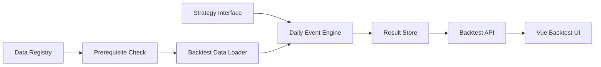
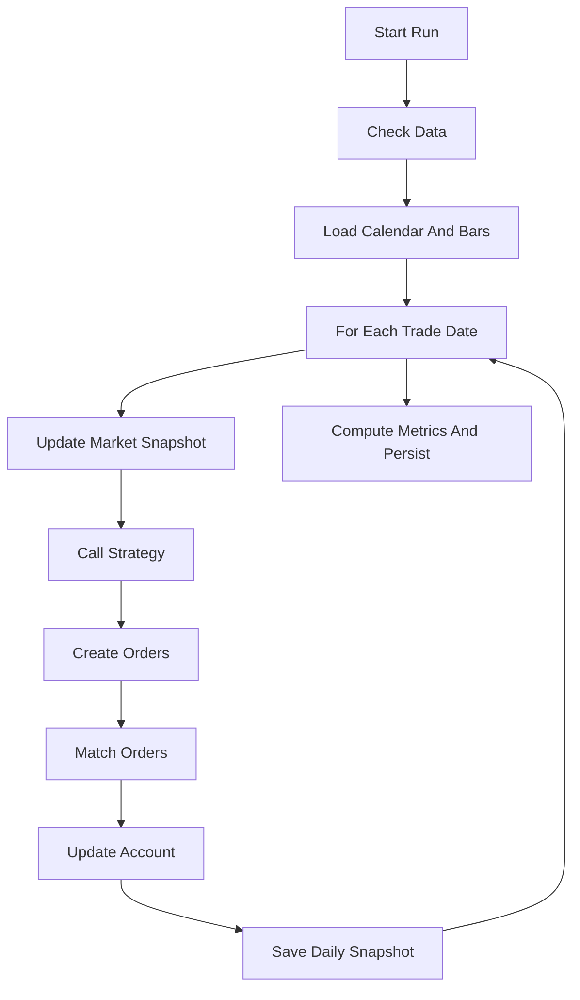

# 回测模块需求文档

## 1. 背景与目标

当前项目已有数据同步、技术指标、策略信号和“信号后 N 日收益统计”能力，但还没有完整的撮合级回测引擎。现有 `backtest_data_daily_job.py` 更适合评估某个信号在未来若干日的表现，不能回答真实组合资金、持仓、成交约束、交易成本和权益曲线问题。

本模块目标是建设一套面向 A 股日线策略的回测能力，基于项目现有数据源治理、交易日历、指标表和 Web 架构，支持可复现的策略研究、结果分析和后续参数调优。

第一期目标：

- 提供日线级事件驱动回测引擎。
- 支持 A 股基础交易约束和交易成本。
- 支持统一策略接口和至少一个示例策略。
- 输出权益曲线、回撤、成交、持仓、账户快照和绩效指标。
- 记录数据血缘和参数快照，保证同一输入可复现。
- 为 Web 回测页面提供稳定 API 契约。

## 2. 范围

第一期只覆盖日线级股票回测。ETF 可以复用相同行情接口作为扩展标的，但不作为第一期验收的硬性范围。模块不接入实盘交易，不处理分钟线、tick、Level2、期货、期权、融资融券或多账户。

第一期回测只使用本地已同步数据。回测启动时如果数据缺失，应明确失败并给出补数建议，不在回测过程中临时隐式拉取大批数据。

## 3. 用户故事

- 作为策略研究者，我可以选择股票池、时间区间、初始资金、交易成本和策略参数，运行一次日线回测。
- 作为数据维护者，我可以在回测启动前看到缺失的交易日、缺失的数据域和建议补跑的 job。
- 作为策略开发者，我可以通过稳定接口编写策略，不直接依赖数据库表名、Web handler 或具体数据源。
- 作为结果分析者，我可以查看权益曲线、回撤曲线、绩效指标、成交记录、每日持仓和账户快照。
- 作为系统维护者，我可以根据 `run_id` 找到回测使用的数据版本、代码版本、参数哈希和错误日志。

## 4. 总体架构



核心模块建议拆分：

- `instock/core/backtest/data_loader.py`：读取交易日历、行情、指标、股票池和数据血缘。
- `instock/core/backtest/engine.py`：按交易日驱动策略、订单、撮合、账户更新。
- `instock/core/backtest/broker.py`：处理订单、成交、T+1、涨跌停、停牌、现金和持仓约束。
- `instock/core/backtest/cost.py`：计算佣金、印花税、过户费和滑点。
- `instock/core/backtest/metrics.py`：计算收益、回撤、夏普、换手率等指标。
- `instock/core/backtest/strategies/`：内置示例策略和现有信号适配器。
- `instock/web/backtest_handler.py` 或等价服务：提供任务 API。

## 5. 数据要求

回测启动前必须通过数据前置检查。检查范围至少包括：

- `trade_calendar`：目标区间交易日完整。
- `daily_bar_raw` 或指定价格域：目标股票池在目标区间有行情数据。
- `daily_spot_snapshot`：如策略或股票池过滤依赖当日快照，必须完整。
- `derived_indicators`：如策略依赖指标表，必须完整。

应复用或扩展：

- `scripts/check_backtest_data.py`
- `instock/core/pipeline/backtest_data_prerequisites.py`
- `instock/core/data/registry.yaml`
- `data_batch` 血缘表

第一期默认价格口径为 `raw`。如果策略需要前复权，应显式设置 `price_mode=qfq`。同一次回测不得混用不同复权口径。

每次回测必须记录：

- 行情数据区间。
- 股票池定义。
- 使用的数据域和 provider。
- `data_batch` 或等价数据版本。
- 复权口径。
- 缺口检查结果摘要。
- 是否混源。

## 6. 回测范式

第一期采用日线事件驱动模型，而不是纯向量化模型。理由是 A 股回测需要明确处理 T+1、涨跌停、停牌、100 股整数手、现金约束、持仓约束和交易成本。

事件流程：



默认撮合口径：

- T 日收盘后生成信号。
- T+1 日按开盘价成交。
- 如果 T+1 停牌、涨停无法买入或跌停无法卖出，则订单拒绝或延后，第一期默认拒绝。
- 成交价可通过参数切换为下一日开盘价或下一日收盘价，但结果必须记录口径。

## 7. A 股交易规则

第一期必须支持：

- T+1：当日买入的持仓不得当日卖出。
- 100 股整数手：买入数量向下取整到 100 股。
- 禁止做空：卖出数量不得超过可卖持仓。
- 现金约束：现金不足时拒单或按可买数量截断，第一期默认截断。
- 持仓约束：支持最大持仓数、单票仓位上限、总仓位上限。
- 停牌：无有效成交价或成交量为 0 时不成交。
- 涨跌停：涨停不可买入，跌停不可卖出。第一期可用日线涨跌幅和开高低收近似判断，后续接入更精确的停牌与涨跌停状态。

## 8. 交易成本

交易成本必须可配置：

- 佣金率，默认可设为万分之三。
- 最低佣金，默认可设为 5 元。
- 印花税，仅卖出收取。
- 过户费，可按成交额比例配置。
- 滑点，可配置为固定价格、基点比例或关闭。

成本计算必须可单独测试。成交记录中应拆分成交金额、佣金、印花税、过户费、滑点成本和总成本。

## 9. 策略接口

策略接口应保持薄而稳定。策略不得直接写数据库，不直接访问 Web handler，不直接控制撮合细节。

建议接口形态：

```python
class Strategy:
    def on_bar(self, context):
        return []
```

`context` 至少包含：

- 当前交易日。
- 当前股票池。
- 历史行情窗口。
- 当前账户状态。
- 当前持仓。
- 可用现金。
- 可选指标或因子数据。
- 策略参数。

策略输出支持两种形态：

- 订单列表：买入、卖出、目标数量。
- 目标权重：由引擎转换为订单。

第一期内置策略：

- 双均线示例策略。
- 现有指标买卖信号适配器。
- 现有 `TABLE_CN_STOCK_STRATEGIES` 策略信号适配器。

## 10. 股票池与组合管理

回测参数必须支持：

- 股票池来源：手工代码列表、现有策略信号表、指数成分或全市场过滤结果。
- 初始资金。
- 最大持仓数量。
- 单票仓位上限。
- 总仓位上限。
- 调仓频率。
- 买入排序规则。
- 卖出优先级。
- 是否允许空仓。

第一期不支持杠杆、做空、多账户、多币种。

## 11. 结果输出

每次回测生成一个 `run_id`。结果至少包括：

- 运行状态：`queued`、`running`、`success`、`failed`、`cancelled`。
- 参数快照。
- 数据血缘。
- 权益曲线。
- 基准曲线。
- 回撤曲线。
- 每日账户快照。
- 每日持仓。
- 成交记录。
- 绩效指标。
- 错误摘要。

绩效指标第一期包括：

- 累计收益。
- 年化收益。
- 最大回撤。
- 夏普比率。
- 年化波动率。
- 胜率。
- 盈亏比。
- 交易次数。
- 平均持仓天数。
- 换手率。
- 相对基准超额收益。

## 12. 存储要求

第一期可以采用“数据库元数据 + 文件结果”的轻量方案：

- 数据库表 `backtest_run` 保存任务状态、参数哈希、数据版本、结果文件路径和错误摘要。
- JSON 或 Parquet 文件保存权益曲线、成交、持仓和账户快照。
- 如后续需要高频查询，再拆分为 `backtest_equity`、`backtest_trades`、`backtest_positions` 等表。

结果必须支持删除。删除时应清理数据库记录和结果文件。失败任务保留错误摘要和必要日志。

## 13. API 与前端

API 以 [`../回测-api契约.md`](../回测-api契约.md) 为准，前端页面设计以 [`回测前端设计.md`](回测前端设计.md) 为准，至少包含：

- 创建回测任务。
- 查询任务列表。
- 查询任务详情。
- 取消运行中任务。
- 删除历史任务。

前端在现有 `/backtest` 占位页基础上实现：

- 参数表单。
- 任务列表。
- 运行状态展示。
- 权益与回撤图。
- 订单记录表。
- 成交表。
- 持仓表。
- 账户快照表。
- 参数和数据血缘摘要。

任务执行必须异步，不能阻塞 Tornado 主线程。第一期可使用后台线程或子进程，后续再引入任务队列。

## 14. 验收标准

详细验收用例见 [`回测验收清单.md`](回测验收清单.md)。

数据验收：

- 缺交易日时拒绝启动，并返回缺失日期和建议补跑 job。
- 缺行情数据时拒绝启动，并返回缺失股票或缺失日期摘要。
- 同一数据版本、同一参数、同一代码版本重复运行，核心输出一致。

撮合验收：

- T+1 限制生效。
- 涨停买入失败。
- 跌停卖出失败。
- 停牌日无成交。
- 现金不足时按规则截断或拒单。
- 非 100 股整数手按规则取整。

成本验收：

- 一笔买入和一笔卖出的佣金、印花税、过户费与手工计算一致。
- 最低佣金规则生效。

策略验收：

- 双均线策略在固定小样本上的信号和成交可解释。
- 现有指标信号适配器能复用已有信号表。

API 验收：

- 创建任务返回 `run_id`。
- 运行中任务可轮询状态。
- 成功任务可返回权益、回撤、成交、持仓和指标。
- 失败任务返回错误摘要。

## 15. 分期

P0：实现数据加载器、前置检查、撮合核心、交易成本、双均线示例、CLI 入口和结果 JSON 输出。

P1：接入现有策略信号、任务 API、结果持久化和 Web 详情页。

P2：支持参数网格、批量股票池、基准对比和结果对比页面。

P3：支持复权因子版本、精确停牌/涨跌停数据、Walk-forward 和样本外验证。

## 16. 非目标

第一期不实现分钟线、tick、Level2、实盘交易、自动下单、复杂订单类型、期货、期权、融资融券、多账户、多币种、盘中动态撮合。
