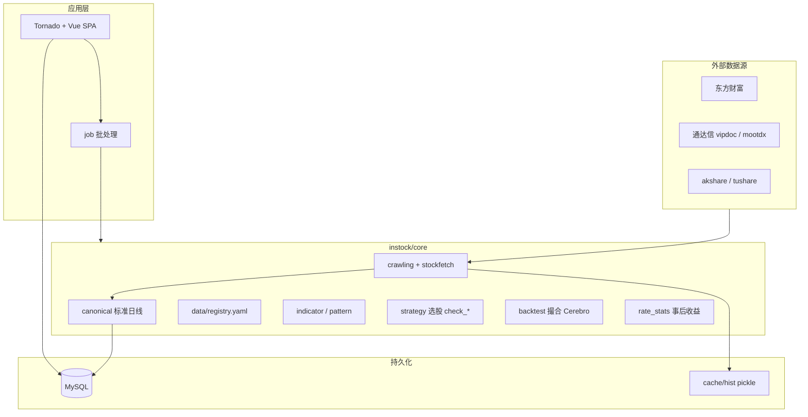
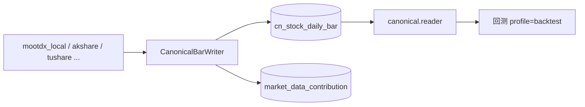
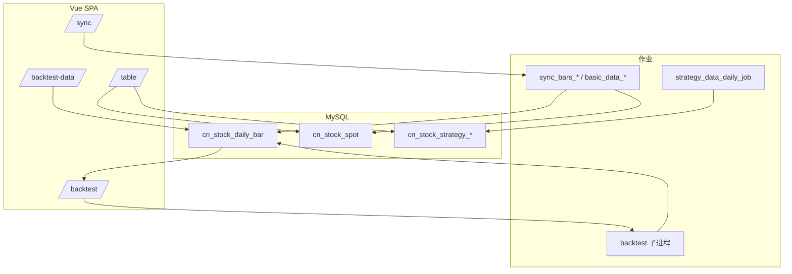

# InStock 架构与前端总览

> **用途**：一页看清系统分层、数据流、Web/API、Vue 路由，以及「规划 vs 已实现」边界。  
> **维护**：**重大变更时须同步更新本文**（见文末 [维护约定](#维护约定)）；细节仍以源码与专题文档为准。  
> **关联**：[架构说明.md](./架构说明.md)（经典数据流详述）、[AGENTS.md](../AGENTS.md)（助手速查）、[plan/索引.md](./plan/索引.md)（长期规划）。

*最后更新：2026-05-25*

---

## 1. 系统总览

InStock 是 **A 股数据采集 → MySQL 落库 → 指标/形态/选股 → 撮合回测 → Web 展示** 的本地量化系统，默认 **Docker + Tornado :9988**。

| 层级 | 职责 | 主要路径 |
|------|------|----------|
| 采集 | HTTP/本地文件拉数、限流重试 | `core/crawling/`、`eastmoney_fetcher.py`、`stockfetch.py` |
| 标准库 raw | 多源独立补数 → 幂等合并 | `cn_stock_daily_bar` |
| 标准库 qfq | 本地 gbbq 派生 | `cn_stock_daily_bar_qfq`、`core/adjustment/` |
| 衍生 | 指标、形态、选股、事后收益 | `indicator/`、`pattern/`、`strategy/`、`backtest/rate_stats.py` |
| 撮合回测 | 资金曲线、订单、成交 | `core/backtest/`（Cerebro + SimBroker） |
| 作业 | 日批、Web 触发子进程 | `instock/job/`、`web/sync_job_service.py` |
| 展示 | API + Vue3 SPA | `instock/web/`、`vue-app/` → `vue-dist/` |

**Python 包根**：`instock/instock/`（`import instock.*`）；**仓库根**：含 `requirements.txt`、`docker/` 的那一层。

---

## 2. 三种「策略 / 回测」（必分清）

| 类型 | 位置 | 做什么 | 输出 |
|------|------|--------|------|
| **选股策略** | `core/strategy/*.py` + `strategy_data_daily_job` | `check_*` 布尔筛选 | `cn_stock_strategy_*` |
| **撮合回测** | `core/backtest/` + `backtest_service` | 事件驱动、T+1 开盘价撮合 | API JSON（权益、订单、成交） |
| **事后收益统计** | `backtest/rate_stats.py` + `backtest_data_daily_job` | 信号后 N 日涨跌 | 策略表扩展列 |

撮合回测实施方案：[plan/回测Backtrader式架构.md](./plan/回测Backtrader式架构.md)（**已实施**阶段 A–E）。

| 内置策略 id | 说明 |
|-------------|------|
| `moving_average_cross` | 双均线（默认） |
| `buy_and_hold` | 买入持有示例 |
| `screening_bridge` | 桥接选股表（需完整依赖注册） |

用户插件：`core/backtest/strategies/plugins/` + `register()`，见 [plan/自定义回测策略.md](./plan/自定义回测策略.md)。

---

## 3. 数据架构

### 3.1 经典路径（原 InStock）

| 概念 | 位置 |
|------|------|
| 表结构元数据 | `core/tablestructure.py` |
| 主数据表 | `cn_stock_spot`、`cn_etf_spot`、资金流、龙虎榜等 |
| 历史 K 线缓存 | `cache/hist/YYYYMM/YYYYMMDD/*.pickle` |
| Web 侧栏模块 | `singleton_stock_web_module_data.py` → `GET /instock/api/nav` |

### 3.2 数据治理路径（2025–2026，部分已落地）

| 概念 | 说明 |
|------|------|
| 标准日线表 | `cn_stock_daily_bar`（迁移 `migrations/003_canonical_daily_bar.sql`） |
| 多源注册 | `core/data/registry.yaml` + `providers/` |
| 按源补数 | `sync_bars_*_job` |
| 管线工具 | `core/pipeline/`（交易日历、质量校验、断档） |
| 关键环境变量 | `INSTOCK_BACKTEST_USE_CANONICAL`、`INSTOCK_USE_DATA_REGISTRY`、`INSTOCK_TDX_DIR` 等（见 [AGENTS.md](../AGENTS.md) §4） |

规划：[plan/数据管线.md](./plan/数据管线.md)、[plan/数据域.md](./plan/数据域.md)。

---

## 4. 作业与调度

| 入口 | 说明 |
|------|------|
| `execute_daily_job.py` | 日作业总控（部分步骤可能被注释，**以源码为准**） |
| `*_daily_job.py` | 单功能作业，支持日期区间（`run_template.run_with_args`） |
| 任务中心 / 数据同步 | `sync_job_service` 子进程跑 `job/*.py`，记录 run |
| Docker cron | 盘中 `basic_data`、收盘 `execute_daily`、定期清 hist 缓存 |
| 预设 | `sync_presets.py`（如 `mootdx_local`） |

Web 触发与观测：`/instock/api/sync/*`（jobs、runs、cancel、data_health、canonical 等）。作业清单见 [作业说明.md](./作业说明.md)。

---

## 5. Web 后端

**框架**：Tornado（`:9988`），全局 DB `torndb`。

### 5.1 路由分组（`web_service.py`）

| 前缀 | 用途 |
|------|------|
| `/instock/api_data`、`/instock/data` | 经典数据表 |
| `/instock/data/indicators` | 指标/K 线 |
| `/instock/api/sync/*` | 同步作业、数据健康、治理、探针 |
| `/instock/api/nav` | Vue 侧栏（`web_module_data`） |
| `/instock/api/table_meta`、`kline_bundle` | 表元数据、K 线包 |
| `/instock/api/backtest/*` | 撮合回测 runs / strategies / kline |
| `/instock/api/host_ops/*` | Mac 宿主机运维 |
| `/instock/app/*` | Vue SPA 入口与静态资源 |

### 5.2 服务层

| 模块 | 文件 |
|------|------|
| 同步作业 | `sync_job_service.py`、`sync_job_handler.py` |
| 调度 | `scheduler_service.py` |
| 回测 | `backtest_service.py`、`backtest_handler.py` |
| 标准库治理 | `canonical_governance_service.py`、`data_sources_service.py` |
| 数据健康 | `data_health_service.py` |

回测 JSON 契约：[回测-api契约.md](./回测-api契约.md)。

---

## 6. 前端（Vue 3 SPA）

**技术栈**：Vue 3、Vue Router、Element Plus、TanStack Query、AG Grid、ECharts  
**源码**：`instock/web/vue-app/`  
**构建**：`npm run build` → `instock/web/vue-dist/`

### 6.1 路由与页面

| 路由 | 页面 | 功能 |
|------|------|------|
| `/home` | 首页 | 入口概览 |
| `/sync` | 数据同步 | 触发作业、Cookie、**数据缺口自检** |
| `/jobs` | 任务中心 | 作业列表、运行记录、Mootdx 本地面板 |
| `/table` | 数据表 | AG Grid 查各业务表 |
| `/indicators` | 股票指标 | K 线/指标详情 |
| `/backtest-data/*` | 回测数据管理 | 概览 / 标准日线 / 补数 / 缺口诊断 |
| `/backtest` | 策略回测 | 新建、列表、详情、权益图、K 线标记 |
| `/backtest/guide` | 自定义策略 | 插件开发说明 |

侧栏：**固定菜单**（`MainLayout.vue`）+ **动态分组**（`/instock/api/nav`，经典 `/instock/data?table_name=` 映射到 `/table`）。

路由定义：`instock/web/vue-app/src/router/index.ts`。

### 6.2 前端 ↔ API

| 功能 | 前端 | API |
|------|------|-----|
| 数据表 | `features/table/DataTableView.vue` | `GET /instock/api_data` |
| 同步与健康 | `views/SyncView.vue` | `/instock/api/sync/*` |
| 回测 | `api/backtest.ts`、`features/backtest/*` | `/instock/api/backtest/*` |
| 标准库治理 | `features/backtest-data/*` | `/instock/api/sync/canonical`、`data_sources` |
| 宿主机运维 | `features/host-ops/HostOpsPanel.vue` | `/instock/api/host_ops/*` |

### 6.3 回测前端：设计 vs 现状

设计文档：[plan/回测前端设计.md](./plan/回测前端设计.md)。

| 能力 | 规划 | 当前（约） |
|------|------|------------|
| 新建回测、策略参数、数据前置检查 | 完整表单分组 | `BacktestPlaceholderView` 已实现主流程 |
| 任务列表 2s 轮询 | 是 | 已实现 |
| 权益/回撤图 | lightweight-charts 或 ECharts | ECharts 权益曲线 |
| 成交/持仓/账户 AG Grid 多 Tab | 是 | 随 API 迭代 |
| 数据血缘、params_hash | 是 | 规划中 |
| K 线买卖点 | 是 | `BacktestKlineChart` |

`/backtest-data` 负责**标准日线治理**；`/backtest` 负责**跑撮合回测**，职责分离。

---

## 7. 端到端数据流

---

## 8. 规划文档地图

统一索引：[plan/索引.md](./plan/索引.md)。

| 文档 | 内容 |
|------|------|
| [plan/路线图.md](./plan/路线图.md) | 阶段 0–5 优先级 |
| [plan/数据管线.md](./plan/数据管线.md) | 分层、幂等、校验、断档 |
| [plan/回测.md](./plan/回测.md) | 撮合模型、成本、复现性 |
| [plan/回测Backtrader式架构.md](./plan/回测Backtrader式架构.md) | Cerebro 实施（已完成） |
| [plan/回测前端设计.md](./plan/回测前端设计.md) | `/backtest` UI |
| [plan/仓库对齐.md](./plan/仓库对齐.md) | 规划 ↔ 代码目录 |

### 路线图阶段（摘要）

| 阶段 | 目标 | 状态（约） |
|------|------|------------|
| 0 基线 | 文档与真实 job 一致 | 持续 |
| 1 数据可维护 | 幂等、校验、备份、断档 | **部分落地**（pipeline、data_health） |
| 2 可复现回测 | Cerebro + 成本规则 | **引擎 A–E 已完成**；元数据/全量测试待补 |
| 3 策略工程化 | Registry + 插件 + CI | **Registry/插件已完成** |
| 4 可观测运维 | 编排可视化、鉴权 | 规划中 |
| 5 Web/工具 | 回测 UI 完善、Makefile | 规划中 |

---

## 9. 改代码时的阅读顺序

1. 总架构：[架构说明.md](./架构说明.md) + 本文 + [AGENTS.md](../AGENTS.md)
2. 回测：`core/backtest/` + [回测-api契约.md](./回测-api契约.md) + `vue-app/src/features/backtest/`
3. 数据/同步：`core/pipeline/`、`sync_job_service` + `SyncView` / `backtest-data/*`
4. **选股策略**：`core/strategy/` + `tablestructure.py`（≠ backtest plugins）
5. **撮合策略插件**：`core/backtest/strategies/plugins/`

---

## 维护约定

以下变更发生时，**须在同一 PR/对话内更新本文**（并视情况更新 [AGENTS.md](../AGENTS.md) §2/§8/§9、[文档索引.md](./文档索引.md) 文首日期）：

| 变更类型 | 更新本文章节 |
|----------|----------------|
| 新主路由 / 新 SPA 页面 | §6.1、§7 |
| 新 API 前缀或回测契约字段 | §5.1、§6.2 |
| 新作业类型 / 预设 id | §4 |
| 标准库表、Registry 源、关键 env | §3.2 |
| 新撮合策略 id / 回测引擎模块 | §2、§8 |
| 路线图阶段状态变化 | §8 表格 |
| 规划 vs 实现边界变化 | §6.3、§8 |

**不必**把 `plan/` 全文抄进本文；只维护「总览级」事实与链接。专题细节仍写在 `架构说明.md`、`plan/*.md` 与各契约文档中。
